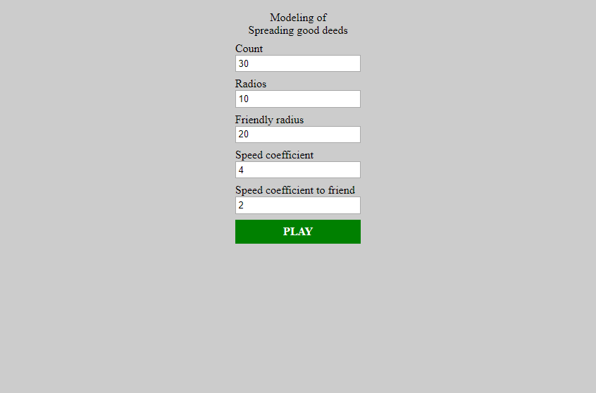
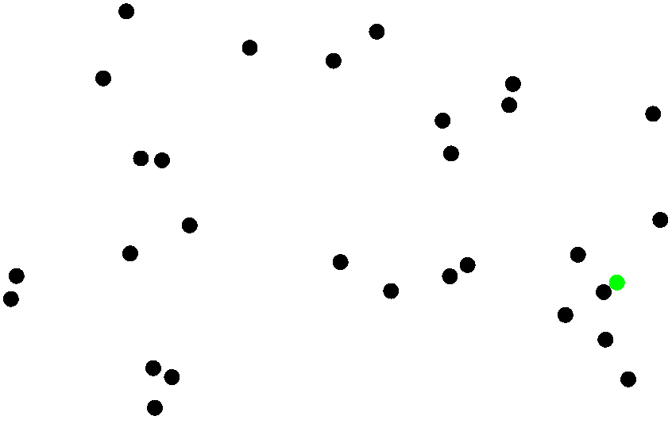
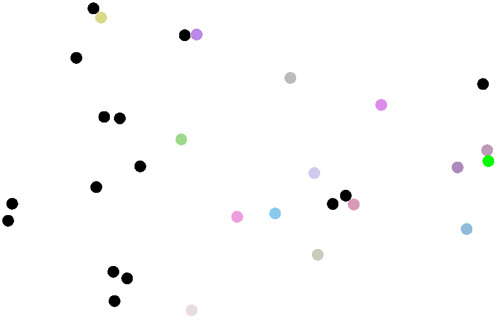
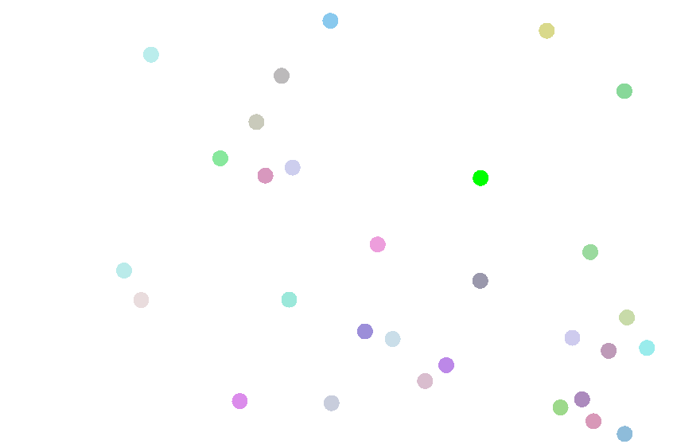

# Points Modeling of Spreading good deeds

#### Dot Challenge

Link [https://dmitriy3342.github.io/points/](https://dmitriy3342.github.io/points/)

**Settings**:

**Result**:

#### Inspired By [Andymation: 900 Page FLIPBOOK // Dot Challenge](https://www.youtube.com/watch?v=hCPdPc553yE)